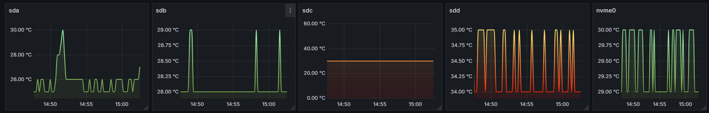

# Prometheus Temperature Disk Exporter

Экспортер для Prometheus, который собирает данные о температуре дисков с помощью smartctl.

## Требования

- smartmontools (для работы с S.M.A.R.T)
- Docker (опционально)

## Пример метрик



## Установка

### Без Docker

```bash
go build
./prometheus-temperature-disk
```

### С Docker

```bash
docker build -t prometheus-temperature-disk .
docker run --privileged -p 9586:9586 prometheus-temperature-disk
```

## Конфигурация

### Переменные окружения

- `EXCLUDED_DEVICES` - список исключаемых устройств через запятую (например: "sda,sdb")

## Метрики

- `disk_temperature_celsius` - температура диска в градусах Цельсия

### Формат метрик

```
# HELP disk_temperature_celsius Current temperature of the disk
# TYPE disk_temperature_celsius gauge
disk_temperature_celsius{device="sda",path="/dev/sda"} 35
```

## Prometheus конфигурация

```yaml
scrape_configs:
  - job_name: 'disk_temperature'
    static_configs:
      - targets: ['localhost:9586']
```

## Поддерживаемые устройства

- SATA диски (sd[a-y])
- NVMe диски (nvme*)
